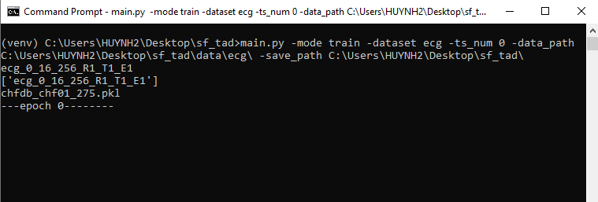
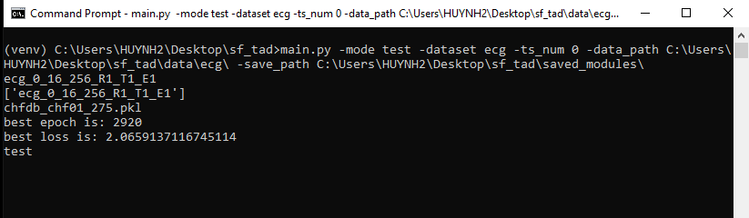

# SF_TAD

Pytorch implementation of SF_TAD framework for Time series anomaly detection

## Abstract

Inspired by the success of the self-supervised learning (SSL) approach in various tasks using unlabeled data and the powerful temporal convolution network (TCN) in temporal feature extraction, we propose a self-supervised-based learning framework for anomaly detection in the time series domain, called SF_TAD. The proposed framework combines three components: data enrichment, reconstruction learning, and contrastive learning. To overcome the data scarcity problem, the first component acts as a training data generator, generating a diverse and rich training dataset using a masking technique. The second component, inspired by the mask-prediction learning technique in SSL, consists of a reconstructor that aims to reconstruct the original input data from the output of the previous component. The last component, inspired by the contrastive learning technique in SSL, consists of a transformation module followed by an encoder. The primary goal of the last component is to distinguish outputs from the previous component. Experimental results on several datasets have shown that our solution achieves state-of-the-art performance. Our method has proven useful for anomaly detection tasks in the time series domain, particularly in real-world time series, where labeling is a time-consuming and challenging task.

## Requirements
The recommended requirements for SF_TAD are specified as follows:
- torch ==1.9.0
- torchvision==0.10+cu111
- torchaudio==0.9.0
- numpy==1.19.2
- pandas==1.0.1
- matplotlib==3.3.1

The dependencies can be installed by:

  
`` pip install -r requirements.txt
``
  

## Dataset
Our framework is evaluated on 5 datasets:
- Univariate datasets:
  - Power demand: This data set records the power demand in a year at a Dutch research facility 
  - UCR : An anomaly detection benchmark is used in KDD-21 competition   
- Multivariate datasets:
  - ECG: This data set consists of 6 time series from electrocardiograms readings
  - 2D-Gestures: This dataset records X Y cordinate of hand gesture in a video
  - PSM: This data set collect internally from multiple application server nodes at eBay

## Usage

The following command illustrates how to train and test the ECG dataset with our framework:

  Train ECG-A sub-dataset:
  

  `` main.py -mode train -dataset ecg -ts_num 0 -dataset_dim 2 ....
  ``  
  

  Test ECG-A sub-dataset:
    

    `` main.py -mode test -dataset ecg -ts_num 0 -dataset_dim 2 ....
    ``  
    

  Detailed descriptions of arguments can be get by 

    

    `` main.py -h
    ``

    

## How to train a model with SF_TAD:
1. Run **main/main_train.py**
2. Since we supported codes to train model, run one of them by seleting the dataset setting in main. Following image shows a example how to train ecg-dataset. (ts_num indicates ordinal number of the sub-dataset)

  

## How to test a model with SF_TAD:
1. Run **main/main_train.py**
2. Since we supported codes to test trained models, run one of them by seleting the dataset setting in main. Following image shows a example how to test ecg-dataset. (ts_num indicates ordinal number of the sub-dataset, saved_path indicates the directory that store the trained model). Our trained models is stored in **saved_modules** 

  

